# 策略广场一期技术架构与实现方案

版本：v0.3  
日期：2026-05-27  
状态：草案，待评审  
关联业务文档：`strategy-marketplace-phase1-business-responsibility.md`

## 1. 背景与目标

策略广场一期只实现以下能力：

1. Marketplace：策略广场展示、筛选、排序、详情、收藏入口、For You 个性化推荐展示。
2. Activity：用户收藏/关注策略后的观察列表、模拟/观察收益、策略信号、部署标记聚合、端内消息流和 Toast。
3. Deployed：真实账户关联、策略真实部署、账户收益、持仓、交易明细，由交易后端直接向前端提供接口。
4. 消息推送：策略发起信号给策略广场后端，策略广场后端生成用户消息并调用 Push 服务，Push 服务通过 WebSocket 推送给前端。
5. 推荐集成：推荐只负责“用户推荐策略展示”这一项，返回策略 ID，不参与广场排序、榜单、Top/New 规则、推送或其他业务推荐。

一期不做：

1. Activity 内真实账户收益、账户链接、真实持仓、真实交易明细。
2. 业务后端代理 Deployed 接口。
3. 推荐参与 Marketplace 普通列表排序、排行榜、人工运营策略位。
4. Hot/热度标签筛选。
5. Benchmark 对比。
6. 完整回测覆盖率和最小样本量作为策略上架强约束。

## 2. 系统边界

### 2.1 团队与服务边界

算法开发：杨文园  
负责策略引擎服务，包括策略维护、用户策略部署信息查询、策略定时回测、实时回测、部署策略自动化交易相关能力。Activity 中如需判断用户哪些策略已部署，由策略广场后端调用策略引擎服务查询当前用户已部署策略信息，并在 Activity 接口中统一聚合返回给前端。

算法开发：丁宇杰  
负责算法策略执行引擎，包括生产策略信号、策略回测、策略观察收益快照、策略事件推送。策略执行侧把信号、异常、调仓、里程碑等事件推送给策略广场后端。

后端业务开发：王正强  
负责策略广场服务，包括策略展示数据维护、Excel 导入初始化、策略展示列表、收藏/Activity、Activity 部署标记聚合、观察收益接口聚合、消息中心、推荐接口对接和推荐兜底。业务后端不计算观察收益、不做算法失败兜底，不处理 Deployed 真实账户、持仓、交易明细，也不代理交易后端接口。

交易开发：丁骏(Jun Ding)  
负责 Deployed 模块，包括券商链接、真实策略部署、账户策略收益、持仓标的、交易明细、券商 API 接入。交易后端直接面向前端提供 Deployed 接口，不经过业务后端。

推荐：毛灵伟、杜庆彪  
只负责 For You 个性化策略展示：接收策略广场后端定期同步的策略数据，根据用户返回推荐策略 ID。推荐不参与策略广场普通列表排序、排行榜、Top/New、消息推送或其他推荐场景。

前端开发：夏维森(Vincent)  
负责 Marketplace、Activity、Deployed 三个 tab 的页面实现和接口联调。Marketplace/Activity 调用策略广场后端，端内实时消息连接 Push 服务 WebSocket，Deployed 调用交易后端。Activity 的部署标记由策略广场后端聚合后返回，前端不再自行调用算法侧接口合并。

### 2.2 服务职责矩阵

| 模块 | 前端调用方 | 后端服务归属 | 是否经过策略广场业务后端 | 一期说明 |
| --- | --- | --- | --- | --- |
| Marketplace 普通列表 | 策略广场后端 | 后端业务 | 是 | 展示、筛选、排序、排行榜、详情 |
| For You 推荐 | 策略广场后端 | 后端业务 + 推荐 | 是 | 后端调用推荐，推荐只返回策略 ID |
| 策略展示信息维护 | 策略广场后端 | 后端业务 | 是 | 一期支持 Excel 导入初始化和更新 |
| 收藏/Activity | 策略广场后端 | 后端业务 + 算法 | 是 | 关注策略、观察收益、信号、消息；观察收益由算法接口返回 |
| Activity 部署标记 | 策略广场后端 | 后端业务 + 算法 | 是 | 后端调用算法侧当前用户部署查询后聚合返回 |
| Activity 真实账户收益 | 无 | 无 | 否 | 一期不展示 |
| Deployed | 交易后端 | 交易 | 否 | 交易后端直接给前端接口 |
| 消息推送 | Push 服务 WebSocket | 后端业务 + 策略侧 + Push 服务 | 是 | 策略侧发信号给业务后端，业务后端调用 Push 服务推给前端 |

## 3. 总体架构

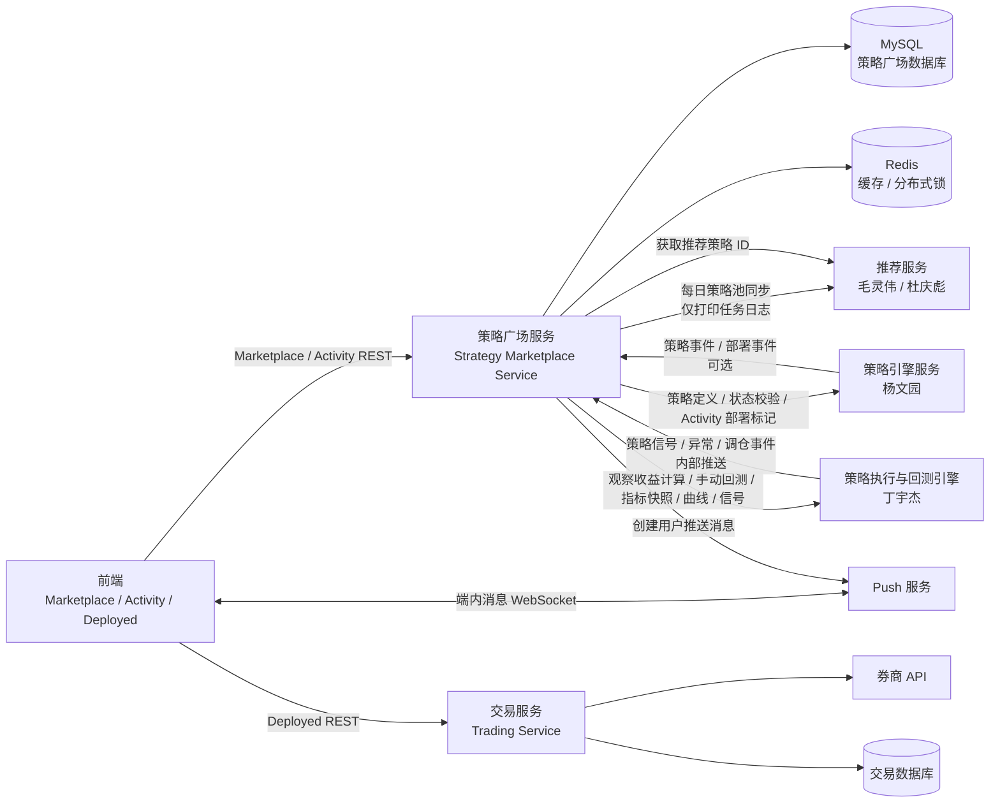

架构原则：

1. 策略广场服务是 Marketplace、Activity 和端内消息落库的唯一业务后端。
2. 推荐服务不持有策略展示最终口径，只返回候选策略 ID，展示字段、状态过滤、兜底逻辑都由策略广场服务控制。
3. Activity 是收藏后的观察工作台，只展示策略执行引擎计算的观察收益，不展示真实账户。
4. Deployed 是真实账户工作台，交易后端直接向前端提供接口。
5. 消息由策略侧产生信号，策略广场服务负责订阅过滤、幂等、落库并调用 Push 服务，Push 服务负责 WebSocket 端内分发。

### 3.1 后端服务技术栈约束

策略广场业务后端按以下技术栈实现，后续详细设计、接口开发和代码评审都以该约束为准：

| 类型 | 技术约定 | 使用范围 |
| --- | --- | --- |
| JDK | JDK 11 | 服务编译、运行时版本 |
| 数据库 | MySQL | 策略展示、指标快照、Activity、消息、导入任务等业务数据存储 |
| 持久层 | MyBatis Plus | DAO 层实体、Mapper、分页、条件查询和基础 CRUD |
| 缓存 | Redis | 列表热点缓存、分布式锁、短期幂等、频控和临时状态 |
| 三方接口调用 | OpenFeign / Feign | 调用策略引擎、算法执行、推荐、Push 等外部服务 |

实现约束：

1. 所有外部 HTTP 服务调用统一通过 Feign Client 封装，不在 Service 中直接拼接 HTTP 请求。
2. MySQL 是业务事实数据的主存储，Redis 只做缓存、锁、频控和临时态，不作为最终事实来源。
3. MyBatis Plus 只放在 DAO 层使用，接入层和业务 Service 不直接操作 Mapper。
4. Feign Client 只负责请求外部服务和协议转换，不承载策略广场业务规则。
5. 接口日志、重试、超时和降级策略在 Feign 配置或 Service 编排层统一处理，避免散落在 Controller。

### 3.2 后端三层目录约束

策略广场服务按标准三层架构组织目录，明确区分接入层、Service 层和 DAO 层：

```text
strategy-marketplace-service/
  src/main/java/com/ainvest/strategy/marketplace/
    controller/              # 接入层：前端 REST、管理接口、内部回调接口
    dto/                     # 接入层请求/响应对象，面向接口协议
    service/                 # Service 层：业务编排、领域规则、事务边界
      impl/
    dao/                     # DAO 层：MyBatis Plus 持久化能力
      entity/                # 数据库实体
      mapper/                # MyBatis Plus Mapper
    client/                  # Feign Client：策略引擎、算法、推荐、Push 等外部服务
      dto/                   # 外部服务请求/响应对象
    job/                     # 定时任务：策略池同步、收藏人数聚合、指标清理等
    config/                  # Feign、MyBatis Plus、Redis、任务等配置
    common/                  # 通用枚举、错误码、工具和基础对象
```

分层调用规则：

1. `controller` 只做参数接收、基础校验和响应包装，只能调用 `service`。
2. `service` 负责核心业务流程编排，可以调用 `dao`、`client`、`Redis` 和事务能力。
3. `dao` 只负责数据库读写，不写跨表业务规则，不调用外部服务。
4. `client` 统一承载 Feign 接口定义和外部协议 DTO，业务含义由 `service` 消化后再返回给接入层。
5. `dto` 与 `entity` 分离，前端协议字段变化不直接污染数据库实体。
6. 定时任务入口放在 `job`，任务内只做调度和参数构造，实际业务处理仍下沉到 `service`。

## 4. 核心技术方案

### 4.1 Marketplace 策略展示

Marketplace 普通列表由策略广场服务直接从本地策略展示表和指标快照表查询，不经过推荐服务。推荐只用于 For You 区域。

展示数据来源：

1. 策略基础展示信息：后端通过 Excel 导入维护，包括名称、标的、市场、策略简介、作者、标签、引擎、状态、Top/New 标记等；Hot/热度标签筛选一期不做。
2. 策略收益和指标：由算法执行/回测侧定时推送或由后端定时拉取后落库，后端保存当前可展示快照。
3. 收藏人数、用户是否已加入 Activity：由策略广场后端根据收藏表计算。
4. For You 推荐顺序：由推荐服务返回策略 ID，后端过滤状态并补齐展示字段。

普通列表展示流程：

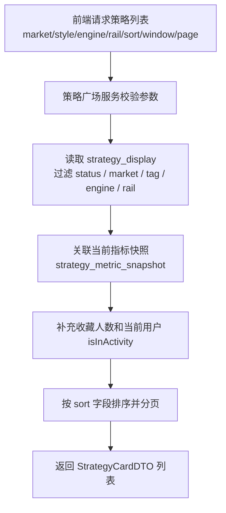

流程说明：

1. 前端只传筛选、排序、分页和指标窗口，不传用户 ID；用户身份由登录态解析。
2. `strategy_display` 是 Marketplace 展示的主数据来源，来自 Excel 导入或后端管理能力，保存策略名称、简介、标签、状态、风险提示等非实时展示字段。
3. `strategy_metric_snapshot` 保存算法侧同步的指标快照，列表页只读取当前窗口的 `is_current = true` 数据，不在列表请求中实时触发回测。
4. `isInActivity` 由 `user_strategy_activity` 当前用户 active 记录判断，用于前端控制按钮状态。
5. 收藏人数可由聚合任务写入指标快照，也可查询收藏表聚合；一期建议由后端定时聚合，避免列表实时 count。
6. 普通列表、排行榜、Top/New 筛选都不调用推荐服务；Hot/热度标签筛选一期不做。

关键字段含义：

| 字段 | 所在位置 | 用途 |
| --- | --- | --- |
| `strategy_id` | `strategy_display`、`strategy_metric_snapshot` | 策略主标识，贯穿 Marketplace、Activity、推荐、部署入口 |
| `status` | `strategy_display` | 单字段控制是否可展示、可推荐、可部署、已下架 |
| `market` | `strategy_display` | 前端市场筛选和展示，例如 `US`、`HK` |
| `tags_json` | `strategy_display` | 前端策略分类 Tag、风格筛选、卡片标签展示 |
| `window_code` | `strategy_metric_snapshot` | 指标窗口，例如 `1M`、`3M`、`6M`、`1Y`、`ALL` |
| `return_pct` | `strategy_metric_snapshot` | 当前窗口区间收益率，用于卡片、排行榜和排序 |
| `curve_json` | `strategy_metric_snapshot` | 当前窗口收益曲线，用于卡片缩略曲线和详情页曲线 |
| `followers_count` | `strategy_metric_snapshot` 或聚合结果 | 收藏人数展示和 `followers` 排序 |

依赖接口：

| 接口名 | 提供方 | 在本流程中的作用 |
| --- | --- | --- |
| `SyncStrategyMetricSnapshot` | 算法策略执行引擎：丁宇杰 | 同步卡片、详情、榜单需要的收益指标和曲线 |
| `QueryStrategyDefinitionStatus` | 策略引擎服务：杨文园 | 可选，用于导入或展示前校验策略 ID 和策略侧状态 |

排序口径一期建议：

| sort | 含义 | 数据来源 |
| --- | --- | --- |
| `ret_1y` | 1 年收益率降序 | `strategy_metric_snapshot.return_pct` |
| `sharpe_1y` | 1 年夏普降序 | `strategy_metric_snapshot.sharpe` |
| `max_dd` | 最大回撤升序 | `strategy_metric_snapshot.max_drawdown_pct` |
| `published_at` | 发布时间降序 | `strategy_display.publish_at` |
| `followers` | 收藏人数降序 | 收藏聚合数据 |

rail 规则一期建议：

| rail | 规则 |
| --- | --- |
| `all` | 所有可展示策略 |
| `top` | `top_flag = true` |
| `new` | `new_flag = true` 或发布时间在配置窗口内 |

说明：Hot/热度标签筛选一期不做，不提供 `hot` rail，也不维护 `hot_flag`。

### 4.2 For You 个性化推荐展示

For You 是一期唯一接入推荐的场景。推荐服务只返回策略 ID 和可选推荐原因，策略广场服务负责过滤、补字段、兜底。

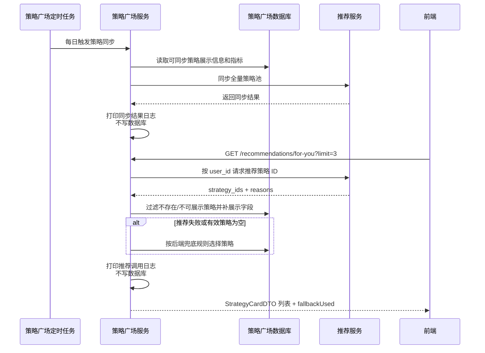

流程说明：

1. 策略广场后端每日把可推荐策略池同步给推荐服务，推荐侧只保存推荐计算所需的策略特征和策略 ID。
2. 前端请求 For You 时仍然调用策略广场后端，策略广场后端再调用推荐服务获取策略 ID 列表。
3. 推荐返回的 `strategy_ids` 不直接透给前端，必须先经过策略广场后端过滤，过滤不存在、不可展示或已下架的策略。
4. 展示字段以策略广场数据库为准，推荐服务不负责策略名称、指标、状态、标签等展示口径。
5. 推荐同步和推荐请求只打印应用日志，不新增推荐同步批次表和推荐请求日志表。
6. `fallbackUsed = true` 表示推荐接口失败、超时、返回空或过滤后无有效策略，前端只做普通推荐区域展示，不需要知道具体失败原因。

关键字段含义：

| 字段 | 所在位置 | 用途 |
| --- | --- | --- |
| `sync_task_time` | 应用日志 | 每日同步任务触发时间，用于联排和日志检索，不落库 |
| `payload_hash` | 应用日志 | 本次同步内容摘要，用于判断策略池是否变化，不落库 |
| `recommend_strategy_ids` | 内存临时结果、应用日志摘要 | 推荐服务原始返回策略 ID，用于排查过滤原因，不落库 |
| `valid_strategy_ids` | 内存临时结果、前端响应补字段依据 | 策略广场过滤后的有效策略 ID |
| `fallback_used` | 前端响应、应用日志 | 是否触发后端兜底策略池 |

依赖接口：

| 接口名 | 提供方 | 在本流程中的作用 |
| --- | --- | --- |
| `SyncRecommendableStrategies` | 推荐服务：毛灵伟、杜庆彪 | 接收策略广场每日同步的可推荐策略池 |
| `GetUserRecommendedStrategies` | 推荐服务：毛灵伟、杜庆彪 | 根据用户返回 For You 推荐策略 ID 和可选推荐原因 |

兜底规则：

1. 推荐接口超时、失败、返回空列表时启用。
2. 后端默认按可展示策略中的 Top 标记、发布时间和核心指标排序生成兜底池。
3. 兜底规则是后端配置，不作为人工运营推荐位。
4. 返回结果仍需要经过策略状态过滤，避免下架策略被展示。

推荐同步策略：

| 项 | 一期方案 |
| --- | --- |
| 同步频率 | 每日一次，后续支持配置化 |
| 同步范围 | 后端本地可展示策略池及必要指标 |
| 记录方式 | 只打印同步任务日志和异常日志，不新增数据库记录 |
| 推荐返回 | 策略 ID 列表，可选推荐原因 |
| 排序责任 | For You 内排序由推荐结果顺序决定 |
| 非推荐场景 | 普通列表、榜单、Top/New 不调用推荐；Hot/热度标签筛选一期不做 |

### 4.3 策略展示信息 Excel 导入

一期策略展示信息由后端统一维护，先支持 Excel 导入方式初始化和更新策略。

Excel 模板按前端需要展示的基础信息设计。页面中由算法实时计算、用户行为产生、交易产生的数据不放在 Excel 中维护。

Excel 模板字段：

| Excel 字段 | 必填 | 数据库存储字段 | 用途和含义 |
| --- | --- | --- | --- |
| `strategy_id` | 是 | `strategy_display.strategy_id` | 策略主标识，必须与算法侧策略 ID 一致 |
| `name` | 是 | `strategy_display.name` | 策略完整名称，卡片、详情、Activity 展示 |
| `short_name` | 否 | `strategy_display.short_name` | 策略短名称，适合卡片空间不足时展示 |
| `symbol` | 是 | `strategy_display.symbol` | 主展示标的，例如 `QQQ`，用于卡片标题旁展示 |
| `market` | 是 | `strategy_display.market` | 市场枚举，例如 `US`、`HK`、`CN`，用于筛选和展示 |
| `universe_type` | 否 | `strategy_display.universe_type` | 标的池类型，例如 `single`、`basket`、`sector` |
| `universe_label` | 否 | `strategy_display.universe_label` | 标的池展示名，例如 `Nasdaq 100 ETF` |
| `universe_detail` | 否 | `strategy_display.universe_detail` | 标的池说明，详情页展示 |
| `author_name` | 否 | `strategy_display.author_name` | 作者展示名 |
| `author_org` | 否 | `strategy_display.author_org` | 作者组织或来源 |
| `author_avatar_color` | 否 | `strategy_display.author_avatar_color` | 前端头像色或作者标识色 |
| `summary` | 是 | `strategy_display.summary` | 策略卡片简介，建议控制长度 |
| `description` | 否 | `strategy_display.description` | 策略详情页完整说明 |
| `strategy_type` | 否 | `strategy_display.strategy_type` | 策略类型，例如 `ETF`、`Equity`、`Crypto`，用于分类筛选 |
| `tags` | 否 | `strategy_display.tags_json` | 展示标签，逗号分隔导入，入库为 JSON 数组 |
| `engine_code` | 是 | `strategy_display.engine_code` | 策略引擎编码，和算法侧识别保持一致 |
| `engine_name` | 否 | `strategy_display.engine_name` | 策略引擎展示名 |
| `parameter_summary` | 否 | `strategy_display.parameter_summary_json` | 参数摘要，导入 JSON 或约定格式，详情页展示 |
| `risk_level` | 否 | `strategy_display.risk_level` | 风险等级，例如 `low`、`medium`、`high` |
| `suitable_users` | 否 | `strategy_display.suitable_users` | 适用用户说明，详情页展示 |
| `risk_disclaimer` | 否 | `strategy_display.risk_disclaimer` | 风险提示或免责声明 |
| `status` | 是 | `strategy_display.status` | 单字段状态，控制可展示、可推荐、可部署、下架 |
| `status_reason` | 否 | `strategy_display.status_reason` | 状态说明，例如下架原因或禁用原因 |
| `top_flag` | 否 | `strategy_display.top_flag` | 是否进入 Top 过滤范围 |
| `new_flag` | 否 | `strategy_display.new_flag` | 是否打 New 标记；也可结合发布时间配置判断 |
| `display_order` | 否 | `strategy_display.display_order` | 同等排序条件下的展示顺序配置，不用于推荐排序 |
| `publish_at` | 否 | `strategy_display.publish_at` | 发布时间，用于 New 和发布时间排序 |

Excel 不维护字段：

| 数据类型 | 原因 | 来源 |
| --- | --- | --- |
| 策略收益、Sharpe、最大回撤、收益曲线 | 指标由算法统一计算，避免手工口径不一致 | `SyncStrategyMetricSnapshot` |
| Activity 观察收益 | 按用户收藏开始时间实时计算 | `BatchCalculateObservationReturn` |
| 手动回测结果 | 实时返回给用户查看，不落库 | `RunManualBacktest` |
| 用户是否已收藏、收藏开始时间 | 用户行为数据 | `user_strategy_activity` |
| 收藏人数 | 用户行为聚合 | 后端聚合任务 |
| For You 推荐排序 | 推荐服务按用户返回 | `GetUserRecommendedStrategies` |
| 真实账户、持仓、订单、成交、账户收益 | 归交易后端和 Deployed 模块 | 交易后端接口 |

导入流程：

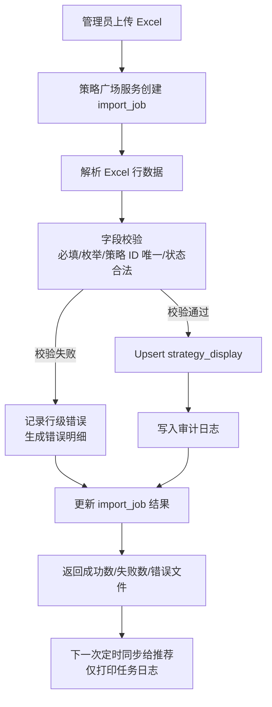

导入流程说明：

1. 上传成功后先创建 `strategy_import_job`，记录文件、操作人和任务状态，方便后台查询导入进度。
2. 解析 Excel 后按行校验必填字段、枚举值、JSON 格式、策略 ID 唯一性和状态合法性。
3. 如接入 `QueryStrategyDefinitionStatus`，可在导入时校验 `strategy_id` 是否存在于策略引擎服务。
4. 校验通过的行按 `strategy_id` Upsert 到 `strategy_display`。
5. 校验失败的行写入 `error_json` 或错误文件，不影响其他成功行入库。
6. 导入成功后策略展示立即按本地库生效；推荐侧仍按每日同步任务获取最新可推荐策略池，同步结果只打印日志，不写数据库。

导入约束：

1. `strategy_id` 作为策略唯一键，策略广场一期始终展示算法侧最新策略定义，不设计版本概念。
2. 状态字段使用单字段表达展示、推荐、部署能力，不拆多个布尔字段。
3. 导入成功后不立即强制同步推荐，一期可由每日任务同步；如需要后台立即生效，可追加手动触发同步接口。
4. 导入失败行不影响成功行入库，但同一次导入需要保留错误明细。

### 4.4 Activity 收藏与观察收益

Activity 是用户把策略加入观察后的工作台。Activity 一期只展示观察收益、策略信号、健康状态和消息，不展示真实账户收益。

加入 Activity 流程：

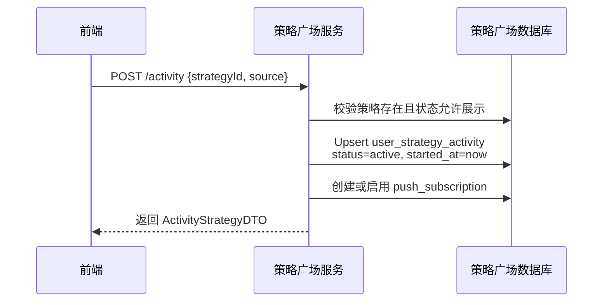

移出 Activity 流程：

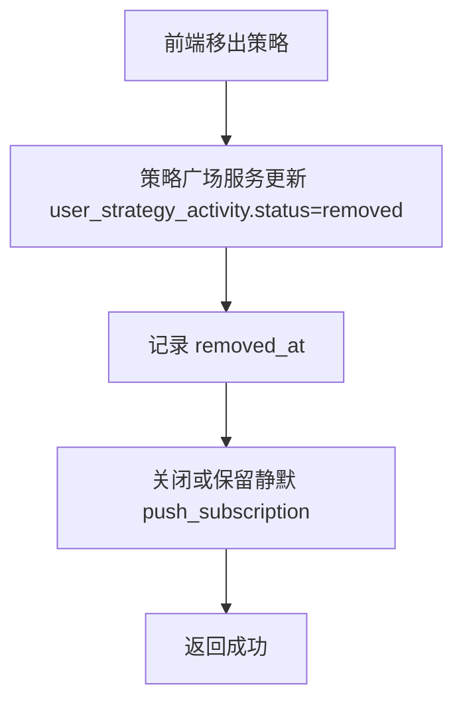

重复加入规则：

1. 用户移出后再次加入，观察收益窗口从最新一次加入时间重新开始。
2. 历史观察快照可以保留，但 Activity 列表只按当前 active 记录的 `started_at` 作为计算开始时间。
3. 同一用户同一策略同一时间只能有一条 active 记录。
4. 加入 Activity 时后端只记录观察开始时间，不在本地计算策略区间收益。

Activity 列表聚合流程：

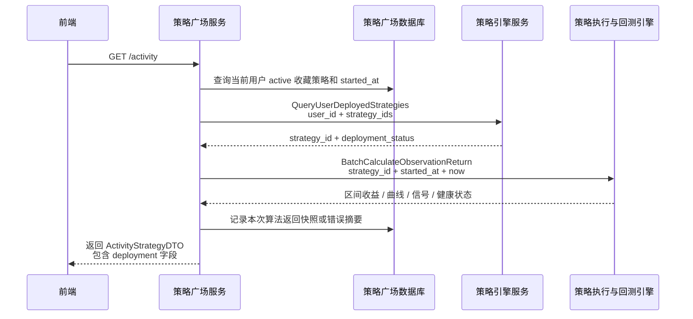

流程说明：

1. `started_at` 是用户最新一次加入 Activity 的时间，是观察收益计算的开始时间。
2. `QueryUserDeployedStrategies` 只用于生成 Activity 的部署标记，返回 `deployment_id`、部署状态和入口类型，不返回账户号、账户收益、持仓和交易明细。
3. `BatchCalculateObservationReturn` 是观察收益权威来源，策略广场后端不使用本地曲线计算、不自行补算、不在算法失败时用历史快照兜底展示为本次结果。
4. `user_strategy_observation_snapshot` 只记录算法返回结果和错误摘要，便于排查和页面刷新时展示“上次计算时间”；是否展示过期结果需要前端明确标识为历史快照，不作为本次计算成功。
5. 如果算法接口对部分策略返回失败，Activity 列表仍可返回策略卡片和部署标记，但该策略的 `metrics.calculationStatus` 应为 `failed`，前端展示失败态或重试入口。

关键字段含义：

| 字段 | 所在位置 | 用途 |
| --- | --- | --- |
| `started_at` | `user_strategy_activity` | 本轮观察开始时间，取消后重新加入会重置 |
| `calculation_end_at` | 算法请求和返回 | 本次观察收益计算截止时间，默认后端请求时的当前时间 |
| `interval_return_pct` | 算法返回、观察快照表 | 观察区间收益率，由算法统一计算 |
| `curve_json` | 算法返回、观察快照表 | 观察区间曲线，前端用于 Activity 卡片曲线 |
| `last_signal_json` | 算法返回、观察快照表 | 最新策略信号，用于 Activity 卡片和消息入口 |
| `health_status` | 算法返回、观察快照表 | 策略运行健康状态，例如 `healthy`、`warning`、`error` |
| `deployment_id` | 部署标记返回 | 前端进入 Deployed 详情需要的入口 ID |

依赖接口：

| 接口名 | 提供方 | 在本流程中的作用 |
| --- | --- | --- |
| `QueryUserDeployedStrategies` | 策略引擎服务：杨文园 | 按用户和策略列表返回 Activity 部署标记 |
| `BatchCalculateObservationReturn` | 算法策略执行引擎：丁宇杰 | 按策略和观察时间区间批量返回观察收益 |

部署标记聚合规则：

1. Activity 部署标记由策略广场后端统一调用算法侧接口获取，并在 Activity 返回值中聚合给前端。
2. 前端不再直接调用算法侧接口合并部署状态。
3. 聚合字段只表示“是否已部署、部署状态、部署入口/详情入口所需 ID”，不返回真实账户收益、账户号、持仓、订单或成交。
4. 真实部署详情仍进入 Deployed，由交易后端直接提供。

### 4.5 Activity 观察收益计算方式

Activity 收益不是用户真实账户收益，而是用户从加入 Activity 开始观察该策略的模拟/观察收益。收益计算由算法策略执行引擎完成，策略广场后端只记录用户收藏开始时间，并用开始时间和当前时间请求算法侧计算区间收益。

核心字段：

| 字段 | 说明 |
| --- | --- |
| `observation_start_at` | 用户最新一次加入 Activity 的时间 |
| `calculation_end_at` | 本次查询的计算截止时间，默认当前时间 |
| `interval_return_pct` | 策略侧按开始时间到截止时间计算的区间收益率 |
| `today_return_pct` | 策略侧返回的最新交易日观察收益 |
| `curve` | 策略侧返回的区间收益曲线 |
| `calculation_status` | 本次计算状态，`success`、`partial_failed`、`failed` |
| `error_code/error_msg` | 策略侧计算失败时返回的错误信息 |

计算口径：

```text
start_at = user_strategy_activity.started_at
end_at = 当前查询时间，或后端传入的 calculation_end_at
interval_return_pct = 策略引擎按 strategy_id + start_at + end_at 计算并返回
```

后端处理方式：

1. 加入 Activity 时记录 `started_at`。
2. 查询 Activity 时以 `started_at` 为开始时间，以当前时间为结束时间。
3. 后端批量调用算法侧区间收益计算接口 `BatchCalculateObservationReturn`。
4. 后端可以把算法侧返回结果记录到 `user_strategy_observation_snapshot`，用于审计、排查和展示“上次计算时间”。
5. 后端不自行根据净值曲线计算收益率，不做算法失败兜底，不把历史快照冒充为本次计算结果。
6. 算法接口失败时，后端返回计算失败状态、错误码和可重试提示，由前端展示失败态。

观察收益生成流程：

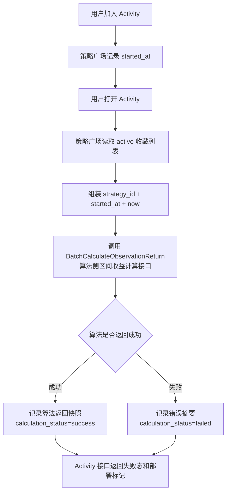

Activity 与部署状态：

1. Activity 接口不返回真实账户字段。
2. 如页面需要展示某策略是否已部署，策略广场后端调用算法侧当前用户已部署策略查询接口。
3. 策略广场后端将 Activity 策略列表、观察收益、部署标记统一聚合后返回给前端。
4. 业务后端不连表交易账户，不转发交易接口，不返回真实账户收益。

### 4.6 策略详情手动回测

手动回测只面向已加入 Activity 的策略。用户在策略详情页输入开始日期和结束日期后，策略广场后端做权限和状态校验，再调用算法策略执行引擎实时计算，结果直接返回给前端查看。手动回测结果不落库，不覆盖 Marketplace 官方指标快照，也不影响 Activity 观察收益。

手动回测流程：

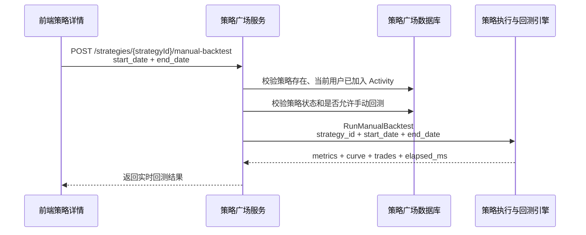

流程说明：

1. 前端不传 `user_id`，策略广场后端从登录态解析用户，并校验该用户当前是否已加入 Activity。
2. `start_date`、`end_date` 是用户输入的回测日期区间，后端只做格式、范围和权限校验，不生成回测任务记录。
3. `RunManualBacktest` 是本流程唯一计算来源，返回指标、曲线和交易列表。
4. 算法侧返回失败时，后端直接返回失败原因和可重试提示；后端不使用历史指标快照兜底。
5. 该结果只用于当前详情页展示，不写入 `strategy_metric_snapshot`、`user_strategy_observation_snapshot` 或导入表。

关键字段含义：

| 字段 | 用途 |
| --- | --- |
| `strategy_id` | 标识要回测的策略 |
| `start_date/end_date` | 用户选择的回测区间 |
| `metrics.return_pct` | 本次自定义区间收益率 |
| `metrics.max_drawdown_pct` | 本次自定义区间最大回撤 |
| `curve` | 本次自定义区间收益曲线 |
| `trades` | 本次自定义区间模拟交易列表 |
| `elapsed_ms` | 算法侧计算耗时 |

依赖接口：

| 接口名 | 提供方 | 在本流程中的作用 |
| --- | --- | --- |
| `RunManualBacktest` | 算法策略执行引擎：丁宇杰 | 根据策略和用户输入日期区间实时返回回测结果 |

### 4.7 消息推送

一期推送只做端内消息流和 Toast，不做短信、邮件、App 系统推送。

事件来源：

1. 策略执行引擎：信号、调仓、止损、回撤告警、运行异常、里程碑。
2. 策略引擎服务：部署相关状态事件，可选。
3. 交易后端：真实部署交易事件原则上属于 Deployed，可由交易端自行处理；如要进入统一消息中心，需要独立评审事件范围。

推送整体流程：

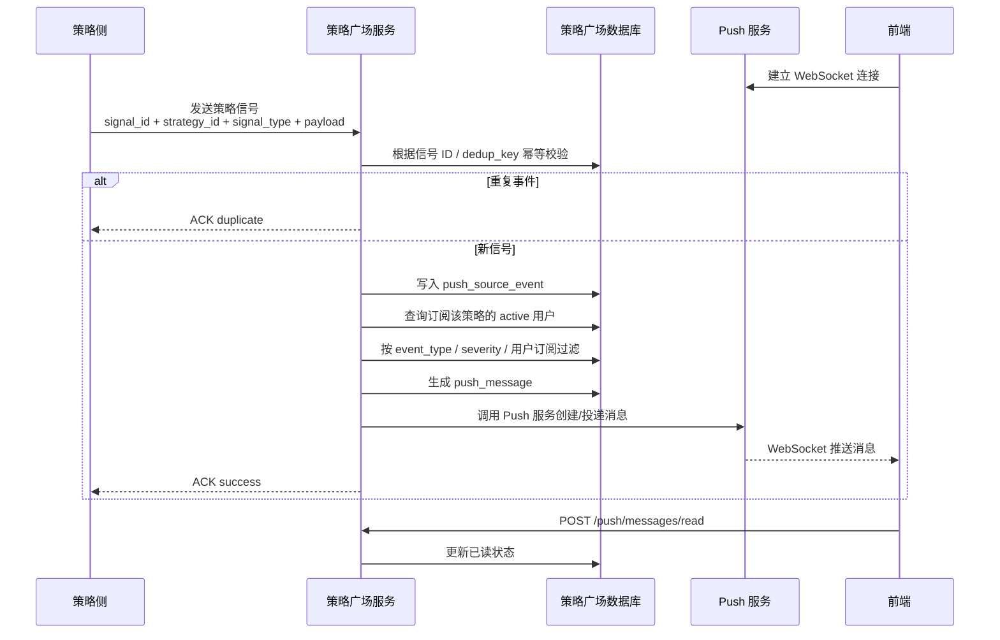

流程说明：

1. 策略侧主动把策略信号、调仓、风控、里程碑等事实事件推送给策略广场后端。
2. 策略广场后端先用 `signal_id/event_id` 做幂等，避免策略侧重试导致重复消息。
3. 后端根据 `strategy_id` 查询订阅该策略的 active 用户，再结合事件类型、严重程度和用户订阅设置生成用户消息。
4. 后端消息落库后调用 Push 服务投递接口，Push 服务负责通过 WebSocket 触达前端。
5. 前端收到 WebSocket 消息后展示 Toast 或刷新消息流；历史消息、未读数和已读操作仍调用策略广场后端。

关键字段含义：

| 字段 | 所在位置 | 用途 |
| --- | --- | --- |
| `event_id/signal_id` | 策略侧事件、`push_source_event` | 事件幂等主键 |
| `dedup_key` | `push_source_event` | 兜底幂等键，用于没有稳定事件 ID 的场景 |
| `event_type` | 策略侧事件、用户消息 | 控制消息分类、订阅过滤和前端展示样式 |
| `severity` | 策略侧事件、用户消息 | 控制是否 Toast、优先级和是否可关闭 |
| `strategy_id` | 策略侧事件、订阅表、消息表 | 用于匹配订阅用户和跳转策略详情 |
| `deployment_id` | 策略侧事件，可空 | 涉及已部署策略时用于跳转 Deployed 详情 |
| `message_id` | `push_message`、Push 请求 | 用户消息唯一 ID，用于已读和投递日志 |
| `cta_type/cta_params_json` | `push_message` | 前端点击后的跳转类型和参数 |

依赖接口：

| 接口名 | 提供方 | 在本流程中的作用 |
| --- | --- | --- |
| `PushStrategySignalEvent` | 策略执行侧：杨文园/丁宇杰 | 策略侧向策略广场后端推送事实事件 |
| `CreateWebPushMessage` | Push 服务：李铎 | 策略广场后端调用 Push 服务创建并投递 WebSocket 消息 |
| `StrategyPushWebSocket` | Push 服务：李铎 | 前端建立 WebSocket 连接并接收实时消息 |

端内分发建议：

| 能力 | 一期方案 |
| --- | --- |
| 消息流 | REST 分页拉取 |
| Toast | Push 服务通过 WebSocket 实时推送 |
| WebSocket | 前端连接 Push 服务，不连接策略广场后端 |
| 投递 | 策略广场后端调用 Push 服务投递接口 |
| 已读 | 支持单条已读和全部已读 |
| 幂等 | 以策略侧 `signal_id/event_id` 为第一幂等键，`source_system + strategy_id + event_type + occurred_at` 为兜底幂等键 |
| 过期 | 一期支持 `expires_at`，默认不过期 |

推送规则一期需要补充确认：

1. 哪些事件类型需要 Toast，哪些只进入消息流。
2. 不同严重级别是否允许用户关闭。
3. 同一策略同一事件类型的频控规则，例如 5 分钟内只提示一次。
4. 用户移出 Activity 后历史消息是否保留、是否继续展示。
5. Deployed 真实交易事件是否进入统一消息中心。

### 4.8 Deployed 模块

Deployed 模块由交易后端直接对前端提供接口。策略广场业务后端只提供策略展示上下文，不参与真实账户链路。

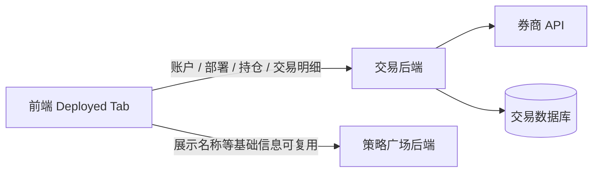

流程说明：

1. Deployed 的账户、部署、持仓、订单、成交、收益全部由交易后端直接面向前端提供。
2. 策略广场后端只提供策略名称、标签、下架状态等基础展示上下文，不代理交易接口。
3. Activity 点击已部署策略时，只使用部署标记中的 `deployment_id` 跳转到 Deployed；进入 Deployed 后由前端直接调用交易后端。
4. Stop & Close 执行完成后，交易侧或策略引擎侧需要同步部署状态，策略广场后端再把 Activity 标记降回 watching。

依赖接口：

| 接口名 | 提供方 | 在本流程中的作用 |
| --- | --- | --- |
| `CreateStrategyDeployment` | 交易后端：丁骏(Jun Ding) | 创建真实或 Paper 策略部署 |
| `QueryDeployedStrategies` | 交易后端：丁骏(Jun Ding) | Deployed 页面查询已部署策略和真实收益 |
| `QueryDeploymentPositions` | 交易后端：丁骏(Jun Ding) | 查询部署策略真实持仓 |
| `QueryDeploymentTrades` | 交易后端：丁骏(Jun Ding) | 查询部署策略订单、成交和交易明细 |
| `StopAndCloseDeployment` | 交易后端：丁骏(Jun Ding) | 停止策略并平仓，完成后回流 Activity watching |

Deployed 一期归属交易侧的能力：

1. 券商账户链接和状态管理。
2. 策略真实部署、暂停、停止、调整。
3. 按账户、策略、部署实例展示真实收益。
4. 持仓标的、订单、成交、交易明细。
5. 不同券商 API 接入和异常处理。

## 5. 后端数据库设计

以下表结构为策略广场业务后端建议设计。交易后端的账户、持仓、订单、成交等表不在本文范围内。

### 5.1 `strategy_display` 策略展示主表

| 字段 | 类型 | 说明 |
| --- | --- | --- |
| `id` | BIGINT PK | 主键 |
| `strategy_id` | VARCHAR(64) | 策略唯一 ID |
| `name` | VARCHAR(128) | 策略名称 |
| `short_name` | VARCHAR(64) | 策略简称 |
| `symbol` | VARCHAR(64) | 主展示标的，例如 `QQQ` |
| `market` | VARCHAR(32) | 市场，例如 `US`、`HK`、`CN` |
| `universe_type` | VARCHAR(32) | 标的池类型，例如 `single`、`basket`、`sector` |
| `universe_label` | VARCHAR(128) | 标的池展示名 |
| `universe_detail` | VARCHAR(512) | 标的池详情 |
| `author_name` | VARCHAR(64) | 作者名称 |
| `author_org` | VARCHAR(64) | 作者组织 |
| `author_avatar_color` | VARCHAR(32) | 前端头像色 |
| `summary` | VARCHAR(512) | 卡片简介 |
| `description` | TEXT | 详情介绍 |
| `strategy_type` | VARCHAR(64) | 策略类型，例如 `ETF`、`Equity`、`Crypto` |
| `engine_code` | VARCHAR(64) | 策略引擎编码 |
| `engine_name` | VARCHAR(128) | 策略引擎名称 |
| `tags_json` | JSON | 标签数组 |
| `parameter_summary_json` | JSON | 参数摘要，详情页展示 |
| `risk_level` | VARCHAR(32) | 风险等级 |
| `suitable_users` | VARCHAR(512) | 适用用户 |
| `risk_disclaimer` | TEXT | 风险提示 |
| `status` | VARCHAR(32) | 单字段状态，见状态表 |
| `status_reason` | VARCHAR(512) | 状态说明，例如下架或禁用原因 |
| `top_flag` | BOOLEAN | Top 标签 |
| `new_flag` | BOOLEAN | New 标签 |
| `display_order` | INT | 同等排序条件下的展示顺序 |
| `publish_at` | TIMESTAMP | 发布时间 |
| `created_at` | TIMESTAMP | 创建时间 |
| `updated_at` | TIMESTAMP | 更新时间 |

唯一索引：

| 索引 | 字段 |
| --- | --- |
| `uk_strategy` | `strategy_id` |

普通索引：

| 索引 | 字段 |
| --- | --- |
| `idx_status_publish` | `status, publish_at` |
| `idx_market_engine` | `market, engine_code` |
| `idx_status_order` | `status, display_order` |

状态能力映射：

| status | Marketplace 展示 | For You 推荐候选 | 允许部署入口 | 说明 |
| --- | --- | --- | --- | --- |
| `draft` | 否 | 否 | 否 | 导入后草稿 |
| `listed` | 是 | 否 | 否 | 可展示但不进推荐 |
| `recommendable` | 是 | 是 | 否 | 可展示、可推荐 |
| `deployable` | 是 | 是 | 是 | 可展示、可推荐、可部署 |
| `offline` | 否 | 否 | 否 | 下架 |
| `disabled` | 否 | 否 | 否 | 禁用或异常 |

说明：`offline` 策略不再进入 Marketplace 新用户展示和推荐候选；但如果用户已收藏或已部署，Activity/Deployed 仍需要展示灰色“已下架”标记，并保留历史回测和交易记录入口。

### 5.2 `strategy_metric_snapshot` 策略指标快照表

| 字段 | 类型 | 说明 |
| --- | --- | --- |
| `id` | BIGINT PK | 主键 |
| `strategy_id` | VARCHAR(64) | 策略 ID |
| `window_code` | VARCHAR(16) | `1M`、`3M`、`6M`、`1Y`、`ALL` |
| `metric_source` | VARCHAR(32) | `backtest`、`simulation`、`live_shadow` |
| `return_pct` | DECIMAL(18,6) | 区间收益率，百分比值 |
| `sharpe` | DECIMAL(18,6) | 夏普 |
| `max_drawdown_pct` | DECIMAL(18,6) | 最大回撤，百分比值 |
| `cagr_pct` | DECIMAL(18,6) | 年化收益率，百分比值 |
| `win_rate_pct` | DECIMAL(18,6) | 胜率，百分比值 |
| `trade_count` | INT | 交易次数 |
| `profit_factor` | DECIMAL(18,6) | 盈亏比，可空 |
| `followers_count` | INT | 收藏人数快照，可由聚合任务写入 |
| `curve_json` | JSON | 曲线点数组 |
| `snapshot_at` | TIMESTAMP | 快照时间 |
| `is_current` | BOOLEAN | 是否当前展示快照 |
| `created_at` | TIMESTAMP | 创建时间 |

索引：

| 索引 | 字段 |
| --- | --- |
| `idx_strategy_current` | `strategy_id, window_code, is_current` |
| `idx_window_return` | `window_code, return_pct` |
| `idx_window_sharpe` | `window_code, sharpe` |

### 5.3 `strategy_holding_snapshot` 策略预览持仓快照表

用于策略详情页展示策略模拟/回测维度的当前组合，不是真实账户持仓。

| 字段 | 类型 | 说明 |
| --- | --- | --- |
| `id` | BIGINT PK | 主键 |
| `strategy_id` | VARCHAR(64) | 策略 ID |
| `symbol` | VARCHAR(64) | 标的代码 |
| `name` | VARCHAR(128) | 标的名称 |
| `market` | VARCHAR(32) | 市场 |
| `weight_pct` | DECIMAL(18,6) | 策略组合权重 |
| `snapshot_at` | TIMESTAMP | 快照时间 |
| `created_at` | TIMESTAMP | 创建时间 |

索引：

| 索引 | 字段 |
| --- | --- |
| `idx_strategy_snapshot` | `strategy_id, snapshot_at` |

### 5.4 `strategy_trade_snapshot` 策略预览交易快照表

用于策略详情页展示模拟/回测的最近交易，不是真实账户交易明细。

| 字段 | 类型 | 说明 |
| --- | --- | --- |
| `id` | BIGINT PK | 主键 |
| `strategy_id` | VARCHAR(64) | 策略 ID |
| `trade_time` | TIMESTAMP | 交易时间 |
| `side` | VARCHAR(16) | `buy`、`sell` |
| `symbol` | VARCHAR(64) | 标的 |
| `quantity` | DECIMAL(24,8) | 数量 |
| `price` | DECIMAL(24,8) | 价格 |
| `reason` | VARCHAR(256) | 策略原因 |
| `created_at` | TIMESTAMP | 创建时间 |

### 5.5 `strategy_import_job` 策略导入任务表

| 字段 | 类型 | 说明 |
| --- | --- | --- |
| `id` | BIGINT PK | 主键 |
| `job_no` | VARCHAR(64) | 导入任务编号 |
| `file_name` | VARCHAR(255) | 原始文件名 |
| `file_url` | VARCHAR(512) | 文件存储地址 |
| `status` | VARCHAR(32) | `pending`、`processing`、`success`、`partial_success`、`failed` |
| `total_count` | INT | 总行数 |
| `success_count` | INT | 成功行数 |
| `fail_count` | INT | 失败行数 |
| `error_json` | JSON | 行级错误 |
| `error_file_url` | VARCHAR(512) | 错误文件地址，可空 |
| `operator_id` | VARCHAR(64) | 操作人 |
| `started_at` | TIMESTAMP | 开始时间 |
| `finished_at` | TIMESTAMP | 完成时间 |
| `created_at` | TIMESTAMP | 创建时间 |

### 5.6 `user_strategy_activity` 用户 Activity 策略表

| 字段 | 类型 | 说明 |
| --- | --- | --- |
| `id` | BIGINT PK | 主键 |
| `user_id` | VARCHAR(64) | 用户 ID |
| `strategy_id` | VARCHAR(64) | 策略 ID |
| `status` | VARCHAR(32) | `active`、`removed` |
| `source` | VARCHAR(32) | `marketplace`、`for_you`、`detail` |
| `started_at` | TIMESTAMP | 当前观察开始时间 |
| `removed_at` | TIMESTAMP | 移出时间 |
| `sort_order` | INT | 用户自定义排序，可空 |
| `created_at` | TIMESTAMP | 创建时间 |
| `updated_at` | TIMESTAMP | 更新时间 |

索引：

| 索引 | 字段 |
| --- | --- |
| `idx_user_status` | `user_id, status, updated_at` |
| `uk_user_strategy_active` | `user_id, strategy_id, status` |

说明：如果数据库支持部分唯一索引，建议只对 `status = active` 建唯一索引；否则在应用层控制同一用户同一策略只有一条 active 记录。

### 5.7 `user_strategy_observation_snapshot` 用户观察收益快照表

| 字段 | 类型 | 说明 |
| --- | --- | --- |
| `id` | BIGINT PK | 主键 |
| `user_id` | VARCHAR(64) | 用户 ID |
| `strategy_id` | VARCHAR(64) | 策略 ID |
| `observation_start_at` | TIMESTAMP | 本轮观察开始时间 |
| `calculation_end_at` | TIMESTAMP | 本次策略侧计算截止时间 |
| `calculation_status` | VARCHAR(32) | `success`、`partial_failed`、`failed` |
| `error_code` | VARCHAR(64) | 算法侧失败错误码，可空 |
| `error_msg` | VARCHAR(512) | 算法侧失败原因，可空 |
| `snapshot_date` | DATE | 快照日期 |
| `interval_return_pct` | DECIMAL(18,6) | 策略侧返回的区间收益率 |
| `today_return_pct` | DECIMAL(18,6) | 今日观察收益率 |
| `sharpe` | DECIMAL(18,6) | 观察区间夏普 |
| `max_drawdown_pct` | DECIMAL(18,6) | 观察区间最大回撤 |
| `win_rate_pct` | DECIMAL(18,6) | 观察区间胜率 |
| `trade_count` | INT | 观察区间交易次数 |
| `curve_json` | JSON | 观察曲线 |
| `last_signal_json` | JSON | 最新信号 |
| `next_run_at` | TIMESTAMP | 下次运行时间 |
| `health_status` | VARCHAR(32) | `healthy`、`warning`、`stale`、`error` |
| `metric_source` | VARCHAR(32) | `simulation`、`paper`、`shadow` |
| `raw_response_json` | JSON | 策略侧计算原始响应摘要，便于排查 |
| `created_at` | TIMESTAMP | 创建时间 |

索引：

| 索引 | 字段 |
| --- | --- |
| `uk_user_strategy_date` | `user_id, strategy_id, observation_start_at, snapshot_date` |
| `idx_user_latest` | `user_id, strategy_id, snapshot_date` |

说明：该表记录算法侧每次观察收益计算结果或错误摘要，用于审计和问题排查。策略广场后端不基于该表自行补算收益，也不在算法接口失败时把历史快照作为本次成功结果兜底返回。

### 5.7.1 手动回测结果不落库说明

策略详情页手动回测结果只在本次请求中实时返回给前端查看，不新增手动回测结果表，也不写入以下表：

1. 不写入 `strategy_metric_snapshot`，避免覆盖官方指标快照。
2. 不写入 `user_strategy_observation_snapshot`，避免和 Activity 观察收益混淆。
3. 不写入策略展示主表，避免 Excel 维护字段和实时计算结果混用。

如后续需要排查性能，可只在接口访问日志中记录 `strategy_id`、`start_date`、`end_date`、`success`、`elapsed_ms` 和错误码，不记录完整曲线和交易明细。链路追踪标识由服务端日志框架自动生成，不作为接口参数或业务字段设计。

### 5.8 `push_subscription` 用户策略消息订阅表

| 字段 | 类型 | 说明 |
| --- | --- | --- |
| `id` | BIGINT PK | 主键 |
| `user_id` | VARCHAR(64) | 用户 ID |
| `strategy_id` | VARCHAR(64) | 策略 ID |
| `enabled` | BOOLEAN | 是否启用 |
| `event_types_json` | JSON | 订阅事件类型，空表示默认类型 |
| `min_severity` | VARCHAR(16) | 最低级别：`info`、`warning`、`critical` |
| `created_at` | TIMESTAMP | 创建时间 |
| `updated_at` | TIMESTAMP | 更新时间 |

索引：

| 索引 | 字段 |
| --- | --- |
| `uk_user_strategy` | `user_id, strategy_id` |
| `idx_strategy_enabled` | `strategy_id, enabled` |

### 5.9 `push_source_event` 策略事件源表

| 字段 | 类型 | 说明 |
| --- | --- | --- |
| `id` | BIGINT PK | 主键 |
| `event_id` | VARCHAR(128) | 事件源唯一 ID，策略信号场景存储 `signal_id` |
| `source_system` | VARCHAR(64) | 来源系统 |
| `event_type` | VARCHAR(64) | 事件类型 |
| `severity` | VARCHAR(16) | `info`、`warning`、`critical` |
| `strategy_id` | VARCHAR(64) | 策略 ID |
| `deployment_id` | VARCHAR(64) | 部署 ID，可空 |
| `user_id` | VARCHAR(64) | 指定用户事件，可空 |
| `occurred_at` | TIMESTAMP | 事件发生时间 |
| `payload_json` | JSON | 原始事件内容 |
| `dedup_key` | VARCHAR(256) | 兜底幂等键 |
| `processed_status` | VARCHAR(32) | `pending`、`processed`、`ignored`、`failed` |
| `received_at` | TIMESTAMP | 接收时间 |
| `created_at` | TIMESTAMP | 创建时间 |

索引：

| 索引 | 字段 |
| --- | --- |
| `uk_event_id` | `event_id` |
| `idx_strategy_event` | `strategy_id, event_type, occurred_at` |
| `idx_dedup_key` | `dedup_key` |

### 5.10 `push_message` 用户消息表

| 字段 | 类型 | 说明 |
| --- | --- | --- |
| `id` | BIGINT PK | 主键 |
| `message_id` | VARCHAR(128) | 消息唯一 ID |
| `user_id` | VARCHAR(64) | 用户 ID |
| `strategy_id` | VARCHAR(64) | 策略 ID |
| `source_event_id` | BIGINT | 来源事件表 ID |
| `event_type` | VARCHAR(64) | 事件类型 |
| `severity` | VARCHAR(16) | 级别 |
| `title` | VARCHAR(128) | 标题 |
| `body` | VARCHAR(1024) | 内容 |
| `cta_type` | VARCHAR(64) | 行动类型，例如 `strategy_detail` |
| `cta_params_json` | JSON | 行动参数 |
| `toast_flag` | BOOLEAN | 是否前端 Toast |
| `read_status` | VARCHAR(16) | `unread`、`read` |
| `read_at` | TIMESTAMP | 已读时间 |
| `created_at` | TIMESTAMP | 创建时间 |
| `expires_at` | TIMESTAMP | 过期时间，可空 |

索引：

| 索引 | 字段 |
| --- | --- |
| `uk_message_id` | `message_id` |
| `idx_user_read` | `user_id, read_status, created_at` |
| `idx_user_strategy` | `user_id, strategy_id, created_at` |

### 5.11 `push_delivery_log` Push 投递记录表

用于记录策略广场后端调用 Push 服务的投递结果，便于排查 WebSocket 连接、离线用户、投递失败和重试。

| 字段 | 类型 | 说明 |
| --- | --- | --- |
| `id` | BIGINT PK | 主键 |
| `message_id` | VARCHAR(128) | 用户消息 ID |
| `user_id` | VARCHAR(64) | 用户 ID |
| `delivery_status` | VARCHAR(32) | `pending`、`sent`、`failed`、`offline`、`ack` |
| `error_code` | VARCHAR(64) | 失败错误码 |
| `error_msg` | VARCHAR(512) | 失败原因 |
| `retry_count` | INT | 重试次数 |
| `sent_at` | TIMESTAMP | 调用 Push 服务时间 |
| `ack_at` | TIMESTAMP | Push 服务 ACK 时间 |
| `created_at` | TIMESTAMP | 创建时间 |
| `updated_at` | TIMESTAMP | 更新时间 |

索引：

| 索引 | 字段 |
| --- | --- |
| `idx_message_id` | `message_id` |
| `idx_user_status` | `user_id, delivery_status, created_at` |

### 5.12 推荐相关数据不落库说明

一期推荐只做 For You 个性化策略 ID 获取，推荐策略池同步和推荐请求排查都不新增数据库表。

不新增以下表：

| 原计划数据 | 一期处理方式 |
| --- | --- |
| 推荐同步批次记录 | 打印应用日志，包含任务触发时间、策略数量、耗时、成功/失败状态和错误摘要 |
| 推荐请求日志 | 打印应用日志，包含用户 ID 脱敏值、推荐返回数量、过滤后数量、是否兜底和耗时 |
| 推荐兜底配置表 | 一期使用服务配置项，默认按 Top 标记、发布时间和核心指标生成兜底池 |

说明：

1. 日志用于联排和问题排查，不作为业务查询数据。
2. 指标监控仍可采集推荐调用耗时、失败次数和兜底次数。
3. 如后续需要推荐效果分析、曝光归因或运营配置，再单独评审是否补充推荐日志表和兜底配置表。

## 6. API 协议文档

接口协议已单独拆分到 `strategy-marketplace-phase1-api-contract.md`。本技术架构文档只保留架构、流程、数据表和依赖边界，避免接口字段在多处重复维护。

## 7. 依赖业务方需要提供的能力

### 7.1 算法策略引擎服务：杨文园

需要提供：

1. 策略基础定义能力：`strategy_id`、策略状态、策略引擎编码。
2. 用户已部署策略查询能力，供策略广场后端在 Activity 中聚合部署标记。
3. 策略部署入口所需参数校验能力，供 Deployed 发起真实部署前使用。
4. 策略运行状态、健康状态、下一次运行时间。
5. 与策略执行侧协作，确保策略事件包含稳定的 `strategy_id` 和 `event_id`。

待提供接口：

| 接口名称 | 作用 | 使用方 | 提供方 | 状态 |
| --- | --- | --- | --- | --- |
| 查询当前用户已部署策略列表 | Activity 后端聚合部署标记，返回策略 ID、部署 ID、部署状态 | 策略广场后端 | 杨文园 | 待提供 |
| 查询策略定义状态 | 策略导入、展示、部署入口校验使用 | 策略广场后端 | 杨文园 | 待提供 |
| 策略部署前校验 | Marketplace/Activity 进入 Deployed 前校验策略是否可部署 | 交易后端或策略广场后端 | 杨文园 | 待提供 |

#### `QueryUserDeployedStrategies` 接口草案

作用：Activity 列表聚合部署标记，不承载账户收益、持仓、订单和成交。

建议入参：

| 字段 | 类型 | 必填 | 含义 |
| --- | --- | --- | --- |
| `user_id` | string | 是 | 当前用户 ID，由策略广场后端传入 |
| `strategy_ids` | string[] | 否 | Activity 当前页策略 ID；为空表示查询该用户全部部署策略 |
| `include_stopped` | boolean | 否 | 是否返回已停止部署，默认 false |

建议出参：

| 字段 | 类型 | 含义 |
| --- | --- | --- |
| `items` | array | 用户部署策略列表 |

`items` 字段：

| 字段 | 类型 | 含义 |
| --- | --- | --- |
| `strategy_id` | string | 策略 ID |
| `deployment_id` | string | 部署实例 ID，前端进入 Deployed 详情使用 |
| `deployment_status` | string | 部署状态，例如 `running`、`stopping`、`stopped`、`failed` |
| `entry_type` | string | `deploy` 或 `deployed_detail` |
| `updated_at` | string | 部署状态更新时间 |

#### `QueryStrategyDefinitionStatus` 接口草案

作用：Excel 导入或部署入口校验时，确认策略 ID 和策略侧状态是否存在。

建议入参：

| 字段 | 类型 | 必填 | 含义 |
| --- | --- | --- | --- |
| `strategy_ids` | string[] | 是 | 待校验策略 ID 列表 |

建议出参：

| 字段 | 类型 | 含义 |
| --- | --- | --- |
| `items` | array | 策略定义状态 |

`items` 字段：

| 字段 | 类型 | 含义 |
| --- | --- | --- |
| `strategy_id` | string | 策略 ID |
| `exists` | boolean | 策略侧是否存在 |
| `engine_code` | string | 策略引擎编码 |
| `engine_status` | string | 策略侧状态，例如 `ready`、`disabled`、`error` |
| `deployable` | boolean | 策略侧是否允许部署 |
| `reason` | string | 不存在、禁用或不可部署原因 |

### 7.2 算法策略执行引擎：丁宇杰

需要提供：

1. 策略指标快照：收益率、夏普、最大回撤、年化收益、胜率、交易次数、曲线。
2. 多窗口指标：至少支持 `1M`、`3M`、`6M`、`1Y`、`ALL` 中一期页面需要的窗口。
3. Activity 区间收益计算：按策略 ID、开始时间、结束时间返回区间收益率、曲线、信号、健康状态。
4. 策略信号：最新信号类型、文案、时间、下一次运行时间。
5. 策略信号推送：按约定信号类型向策略广场后端推送，保证 `signal_id/event_id` 幂等 ID。
6. 回测/模拟持仓和最近交易快照，供策略详情预览使用。

关键要求：

1. 指标口径需要在联调前确认，例如收益率是否扣费、曲线是否复权、交易日时区。
2. Activity 观察收益由算法侧计算，业务后端只记录收藏开始时间和算法返回结果摘要，不做本地收益计算和失败兜底。
3. 信号推送需要支持失败重试，后端按 `signal_id/event_id` 幂等处理。

待提供接口：

| 接口名称 | 作用 | 使用方 | 提供方 | 状态 |
| --- | --- | --- | --- | --- |
| 批量计算策略区间收益 | Activity 根据用户收藏开始时间和当前时间计算观察收益 | 策略广场后端 | 丁宇杰 | 待提供 |
| 策略详情手动回测 | 用户输入日期区间后实时返回回测结果，不落库 | 策略广场后端 | 丁宇杰 | 待提供 |
| 同步策略指标快照 | Marketplace 卡片、排行榜、详情页展示收益指标和曲线 | 策略广场后端 | 丁宇杰 | 待提供 |
| 推送策略信号事件 | 策略侧产生信号后通知业务后端落库并调用 Push 服务 | 策略广场后端 | 丁宇杰 | 待提供 |
| 同步策略预览持仓和交易快照 | 策略详情页展示模拟/回测持仓和最近交易 | 策略广场后端 | 丁宇杰 | 待提供 |

#### `BatchCalculateObservationReturn` 接口草案

作用：Activity 观察收益计算。该接口是观察收益权威来源，策略广场后端不兜底计算。

建议入参：

| 字段 | 类型 | 必填 | 含义 |
| --- | --- | --- | --- |
| `user_id` | string | 是 | 当前用户 ID，用于算法侧审计或限流 |
| `items` | array | 是 | 待计算策略列表 |
| `include_curve` | boolean | 否 | 是否返回曲线，默认 true |
| `include_signal` | boolean | 否 | 是否返回最新信号，默认 true |

`items` 字段：

| 字段 | 类型 | 必填 | 含义 |
| --- | --- | --- | --- |
| `strategy_id` | string | 是 | 策略 ID |
| `start_time` | string | 是 | 观察开始时间，来自用户最新加入 Activity 的 `started_at` |
| `end_time` | string | 是 | 计算截止时间，默认策略广场后端请求时的当前时间 |

建议出参：

| 字段 | 类型 | 含义 |
| --- | --- | --- |
| `calculated_at` | string | 算法完成计算时间 |
| `items` | array | 各策略计算结果 |

`items` 字段：

| 字段 | 类型 | 含义 |
| --- | --- | --- |
| `strategy_id` | string | 策略 ID |
| `status` | string | `success` 或 `failed` |
| `interval_return_pct` | number | 观察区间收益率，百分比值 |
| `today_return_pct` | number | 最新交易日收益率，百分比值 |
| `sharpe` | number | 观察区间夏普 |
| `max_drawdown_pct` | number | 观察区间最大回撤，百分比值 |
| `win_rate_pct` | number | 观察区间胜率，百分比值 |
| `trade_count` | int | 观察区间交易次数 |
| `curve` | array | 曲线点，格式 `[{date,value}]` |
| `last_signal` | object | 最新策略信号摘要 |
| `next_run_at` | string | 下次策略运行时间 |
| `health_status` | string | `healthy`、`warning`、`stale`、`error` |
| `error_code` | string | 失败错误码，可空 |
| `error_msg` | string | 失败原因，可空 |

#### `RunManualBacktest` 接口草案

作用：策略详情页手动回测。结果实时返回给用户查看，不落库。

建议入参：

| 字段 | 类型 | 必填 | 含义 |
| --- | --- | --- | --- |
| `user_id` | string | 是 | 当前用户 ID，用于算法侧审计或限流 |
| `strategy_id` | string | 是 | 策略 ID |
| `start_date` | string | 是 | 用户选择的回测开始日期，`yyyy-MM-dd` |
| `end_date` | string | 是 | 用户选择的回测结束日期，`yyyy-MM-dd` |
| `initial_capital` | string | 否 | 初始资金，如算法侧需要；一期可由算法默认 |
| `include_trades` | boolean | 否 | 是否返回交易列表，默认 true |

建议出参：

| 字段 | 类型 | 含义 |
| --- | --- | --- |
| `status` | string | `success` 或 `failed` |
| `strategy_id` | string | 策略 ID |
| `start_date` | string | 回测开始日期 |
| `end_date` | string | 回测结束日期 |
| `metrics` | object | 回测指标 |
| `curve` | array | 回测曲线 |
| `trades` | array | 回测交易列表 |
| `elapsed_ms` | int | 计算耗时 |
| `error_code` | string | 失败错误码，可空 |
| `error_msg` | string | 失败原因，可空 |

`metrics` 建议字段：

| 字段 | 类型 | 含义 |
| --- | --- | --- |
| `return_pct` | number | 区间收益率 |
| `annual_return_pct` | number | 年化收益率 |
| `sharpe` | number | 夏普 |
| `max_drawdown_pct` | number | 最大回撤 |
| `win_rate_pct` | number | 胜率 |
| `trade_count` | int | 交易次数 |

#### `SyncStrategyMetricSnapshot` 接口草案

作用：算法侧同步 Marketplace、排行榜、详情页展示需要的官方指标快照。

建议入参：

| 字段 | 类型 | 必填 | 含义 |
| --- | --- | --- | --- |
| `batch_no` | string | 是 | 指标同步批次 |
| `items` | array | 是 | 指标快照列表 |

`items` 字段：

| 字段 | 类型 | 必填 | 含义 |
| --- | --- | --- | --- |
| `strategy_id` | string | 是 | 策略 ID |
| `window_code` | string | 是 | `1M`、`3M`、`6M`、`1Y`、`ALL` |
| `metric_source` | string | 是 | `backtest`、`simulation`、`live_shadow` |
| `return_pct` | number | 是 | 区间收益率 |
| `sharpe` | number | 否 | 夏普 |
| `max_drawdown_pct` | number | 否 | 最大回撤 |
| `cagr_pct` | number | 否 | 年化收益率 |
| `win_rate_pct` | number | 否 | 胜率 |
| `trade_count` | int | 否 | 交易次数 |
| `curve` | array | 否 | 曲线点 |
| `snapshot_at` | string | 是 | 指标快照时间 |

建议出参：

| 字段 | 类型 | 含义 |
| --- | --- | --- |
| `accepted` | boolean | 是否接收 |
| `batch_no` | string | 批次号 |
| `success_count` | int | 成功条数 |
| `fail_count` | int | 失败条数 |
| `errors` | array | 行级错误 |

### 7.3 推荐服务：毛灵伟、杜庆彪

需要提供：

1. 策略池同步接收接口。
2. 按用户返回 For You 推荐策略 ID 的接口。
3. 超时和异常时明确错误码。

不需要提供：

1. Marketplace 普通列表排序。
2. 榜单排序。
3. Top/New 规则。
4. 推送规则。
5. 策略展示字段维护。
6. 人工运营策略配置。

待提供接口：

| 接口名称 | 作用 | 使用方 | 提供方 | 状态 |
| --- | --- | --- | --- | --- |
| 同步策略池 | 策略广场后端每日同步策略展示数据和必要指标给推荐 | 策略广场后端 | 毛灵伟、杜庆彪 | 待提供 |
| 获取 For You 推荐策略 ID | 根据当前用户返回推荐策略 ID 列表 | 策略广场后端 | 毛灵伟、杜庆彪 | 待提供 |

### 7.4 Push 服务：李铎

需要提供：

1. 前端 WebSocket 连接能力。
2. 业务后端调用 Push 服务创建/投递消息的能力。
3. 在线用户连接管理、消息投递 ACK 或失败回调。
4. WebSocket 鉴权、断线重连、心跳机制。

待提供接口：

| 接口名称 | 作用 | 使用方 | 提供方 | 状态 |
| --- | --- | --- | --- | --- |
| 创建并投递 Push 消息 | 策略广场后端生成用户消息后调用 Push 服务实时投递 | 策略广场后端 | 李铎 | 已有测试接口，正式协议待补充 |
| 前端 WebSocket 连接 | 前端建立端内消息连接，接收 Toast 和消息通知 | 前端 | 李铎 | 待提供 |
| Push 投递结果回调 | Push 服务回传投递成功、失败或离线状态，便于后端记录 | Push 服务 | 李铎 | 待提供 |

当前已知 Push 投递接口方向：

| 项 | 内容 |
| --- | --- |
| 请求方式 | `POST` |
| 测试地址 | `http://ainvest-api.touzime.com/gw/touchspot/v1/touch/spot` |
| Header | `callerType: PARTNER`、`Content-Type: application/json` |
| 推送类型 | `touchType = WEB_PUSH` |
| 触达方式 | `content.gmsPushType = WEB_SOCKET` |
| 用户范围 | `allUserPush = false`，通过 `userIdList` 定向推送 |

### 7.5 交易后端：丁骏(Jun Ding)

需要提供：

1. 券商账户链接、解绑、状态查询。
2. 真实策略部署、暂停、恢复、停止。
3. Deployed 列表和详情。
4. 真实账户维度收益、策略部署维度收益。
5. 持仓、订单、成交、交易明细。
6. 券商 API 接入和异常处理。

接口边界：

1. 交易后端直接面向前端提供接口。
2. 策略广场业务后端不代理交易接口。
3. Activity 不展示交易后端字段。
4. Marketplace 或 Activity 的部署入口只传递 `strategy_id` 等策略上下文，真实部署流程进入 Deployed/交易链路。

待提供接口：

| 接口名称 | 作用 | 使用方 | 提供方 | 状态 |
| --- | --- | --- | --- | --- |
| 查询券商账户列表 | Deployed 展示账户连接状态 | 前端 | 丁骏(Jun Ding) | 待提供 |
| 创建策略部署 | 用户从 Marketplace/Activity 进入真实部署流程 | 前端 | 丁骏(Jun Ding) | 待提供 |
| 查询部署策略列表 | Deployed 展示已部署策略和真实收益 | 前端 | 丁骏(Jun Ding) | 待提供 |
| 查询部署持仓 | Deployed 展示真实持仓 | 前端 | 丁骏(Jun Ding) | 待提供 |
| 查询部署交易明细 | Deployed 展示真实订单、成交、交易明细 | 前端 | 丁骏(Jun Ding) | 待提供 |
| 暂停/恢复/停止部署 | Deployed 管理真实部署策略 | 前端 | 丁骏(Jun Ding) | 待提供 |

### 7.6 前端：夏维森(Vincent)

需要实现：

1. Marketplace 普通列表、For You、排行榜、详情、收藏入口。
2. Activity 收藏策略列表、观察收益、信号、消息入口。
3. Activity 展示策略广场后端返回的部署标记，不再自行调用算法侧接口合并。
4. Deployed 直接调用交易后端接口。
5. 连接 Push 服务 WebSocket，展示 Toast 和端内消息通知。
6. Push 消息流、未读数、已读操作仍调用策略广场后端。
7. 接口异常兜底：推荐失败展示后端兜底策略，WebSocket 断开时可展示重连状态或降级拉取消息列表。

## 8. 安全与权限

1. 所有用户态接口的 `user_id` 从登录态获取，不能由前端传入。
2. Activity、Push 按当前登录用户隔离；推荐调用日志只打印必要排查字段，用户 ID 建议脱敏。
3. 内部接口需要服务鉴权，例如签名、内网白名单或服务 token。
4. Excel 导入接口只允许管理角色访问。
5. Activity 不返回真实账户数据，避免和 Deployed 权限边界混淆。
6. Push 消息创建时需要校验用户订阅关系，不能把其他用户的事件误投递。
7. 排查类 trace 标识由服务端网关、日志框架或 APM 自动生成，不作为前端入参、外部接口入参或业务协议字段设计。

## 9. 可观测性与任务调度

建议监控指标：

| 指标 | 说明 |
| --- | --- |
| `marketplace_list_latency_ms` | 策略列表耗时 |
| `recommendation_request_latency_ms` | 推荐接口耗时 |
| `recommendation_fallback_count` | 推荐兜底次数 |
| `strategy_import_success_count` | 导入成功行数 |
| `strategy_import_fail_count` | 导入失败行数 |
| `push_event_ingest_count` | 接收事件数 |
| `push_message_created_count` | 生成消息数 |
| `push_event_duplicate_count` | 幂等去重数 |
| `push_delivery_fail_count` | 调用 Push 服务投递失败数 |
| `activity_interval_calculation_latency_ms` | Activity 区间收益计算耗时 |

定时任务：

| 任务 | 频率 | 说明 |
| --- | --- | --- |
| 推荐策略池同步 | 每日一次，后续配置化 | 策略广场后端同步给推荐，只打印任务日志，不写数据库 |
| 指标当前快照聚合 | 每日或按算法推送触发 | 更新 `is_current` |
| 收藏人数聚合 | 每日或小时级 | 更新策略卡片 followers |
| 消息过期清理 | 每日 | 清理或归档过期消息 |

## 10. 待确认问题

1. Push 事件类型枚举、严重级别、Toast 规则、频控规则。
2. Push WebSocket 鉴权方式、断线重连和投递 ACK 机制。
3. Activity 区间收益计算接口的批量上限、超时时间、部分失败返回格式和限流规则。
4. 策略指标快照的收益口径：是否扣费、是否复权、是否包含滑点。
5. 榜单窗口一期是否固定 `1Y`，还是前端原型中的 `1M/3M/6M/1Y/All` 全部支持。
6. Excel 导入是否需要后台页面，还是一期只提供接口和模板下载。
7. 策略状态从 `listed` 到 `deployable` 的审批流程是否需要后台审核。
8. Deployed 的真实交易事件是否需要进入统一消息中心；若需要，需要交易侧和业务侧单独定义事件范围。
9. 推荐策略池同步字段是否包含用户不可见的内部特征；如包含，需要确认脱敏、权限和日志打印范围。
10. 手动回测日期范围、最长区间、并发限制和每日次数限制。

## 11. 一期交付拆分建议

| 阶段 | 交付内容 | 依赖 |
| --- | --- | --- |
| P1-1 | 策略展示表、Excel 导入、Marketplace 普通列表和详情 | 后端、前端 |
| P1-2 | 指标快照接入、排行榜、收藏人数聚合 | 算法执行、后端 |
| P1-3 | Activity 收藏、区间收益计算、部署标记聚合、信号展示 | 算法执行、算法策略引擎、后端、前端 |
| P1-4 | 策略信号接入、业务消息落库、Push 服务 WebSocket 投递、已读 | 算法执行、后端、Push 服务、前端 |
| P1-5 | For You 推荐策略 ID 接入、每日同步、兜底 | 推荐、后端、前端 |
| P1-6 | Deployed 前端直连交易后端联调 | 交易、前端 |
